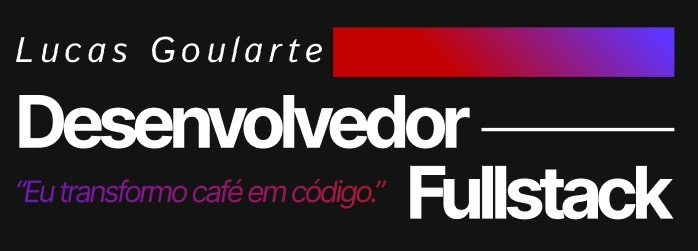

<h2 align="center">
  Hi 👋! I'm Lucas Goularte
  
</h2>

---

### About Me

I am a final-semester student of Systems Analysis and Development at SENAC Tubarão with over three years of experience in the technology industry.  
I have solid expertise in Java and C#, with strong knowledge in .NET, Domain-Driven Design (DDD), and Test-Driven Development (TDD).  
On the front-end, I build interfaces using React, Vue.js, and Flutter, applying best practices to deliver high-quality user experiences.  
I also work as a freelancer, delivering complete and functional projects for a variety of clients.

---

### Key Projects

- **ZH Solution ONE** – Monitoring platform for NOx sensors and catalytic efficiency systems.  
- **Vaccine Control Platform** – Academic extension project for managing vaccination data.  
- **Artif** – Humanized AI assistant platform for orthodontic customer service.  
- **DAF** – System for monitoring truck status and emission control equipment.

---

### Skills Breakdown

- **Languages:** Java, C#, HTML, CSS  
- **Frameworks & Libraries:** React, Vue.js  
- **Testing:** JUnit (Java), xUnit / NUnit (C#)  
- **Automated Testing:** Vue Test Utils + Jest, React Testing Library + Jest  
- **Databases:** MySQL, PostgreSQL, SQLite, Hive  
- **Version Control:** Git, GitHub, GitLab  
- **Containerization:** Docker  
- **Architecture:** Domain-Driven Design (DDD), MVVM, Hexagonal Architecture (Ports and Adapters), SOLID Principles  
- **Agile:** Scrumban

---

### Languages and Tools

  
  
  
  
  
  
  
  
  
  
  
  
  
  
  
  

---

### Connect with Me

  
  
  
  

---

